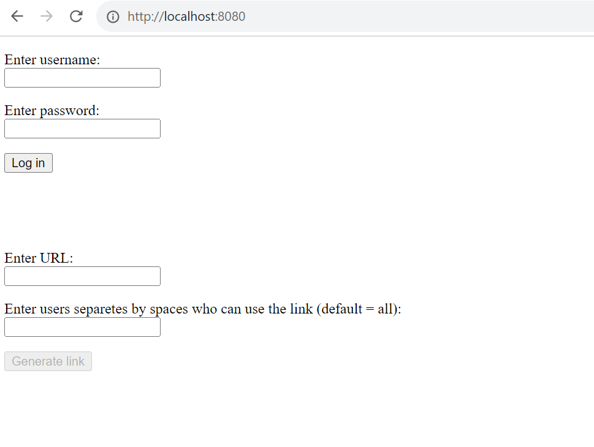
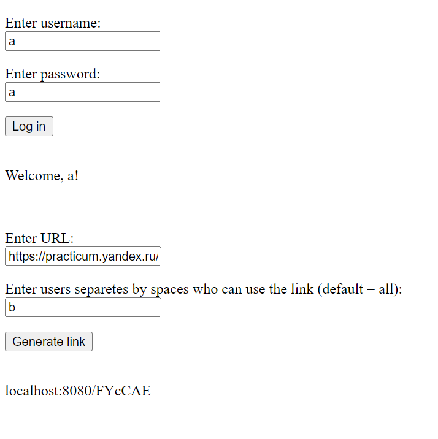
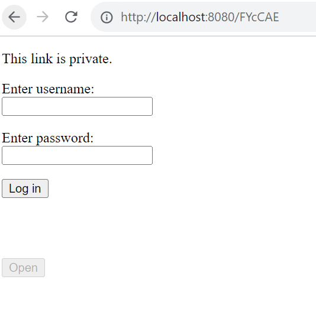
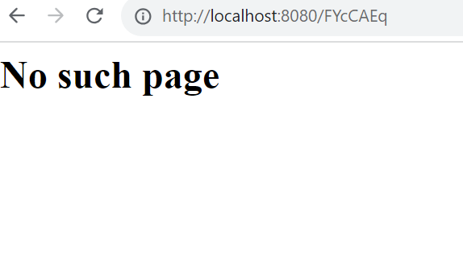
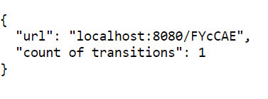
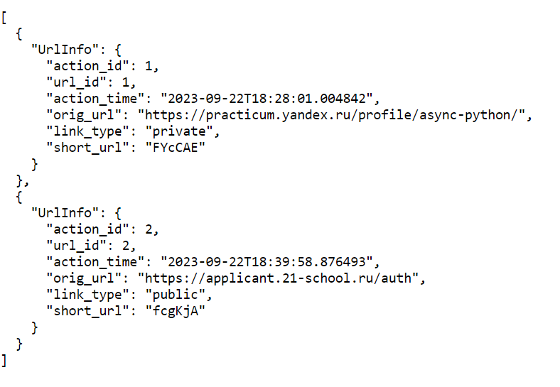
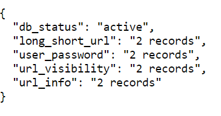
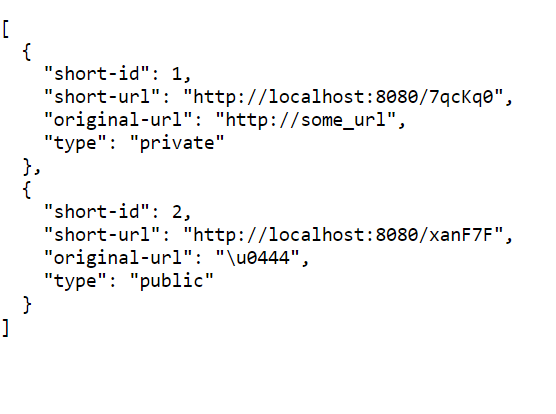

# Инструкция

## Установка пакетов
```
pip install -r requirements.txt
```

## Переменные окружения
Cоздайте файл .env с содержимым по примеру .env.example

## Запуск контейнера с тестовой БД

```
docker run \
  --rm   \
  --name postgres-fastapi-test \
  -p 1234:5432 \
  -e POSTGRES_USER=postgres \
  -e POSTGRES_PASSWORD=postgres \
  -e POSTGRES_DB=collection \
  -d postgres:14.5
```


## Тестирование

```
pytest
```

## Запуск контейнера с БД

```
docker run \
  --rm   \
  --name postgres-fastapi \
  -p 5432:5432 \
  -e POSTGRES_USER=postgres \
  -e POSTGRES_PASSWORD=postgres \
  -e POSTGRES_DB=collection \
  -d postgres:14.5
```

## Миграции

### Выполнить миграции
```
alembic upgrade head
```

### Отменить все миграции
```
alembic downgrade base
```

## Запуск сервиса
```
python3 main.py
```

## Запуск без автоматического применения миграций
```
python3 main --migration-off
```

## Пример использования

### Основной функционал

Сервер стартует по адресу http://localhost:8080 (по умолчанию).
Управление переменными окружения PROJECT_HOST и PROJECT_PORT.
 <p> </p> <p> </p>
Введи логин и пароль для возможности генерировать сокращенные ссылки.
При генерации ссылки возможно указать ограничения, какие пользователи будут иметь доступ к ресурсу.
 <p> </p> <p> </p>

При попытке перехода по приватной ссылке откроется форма аутентификации.
 <p> </p> <p> </p>

В данном случае доступ к ресурсу имеет только создатель и b (пользователю, которому разрешили доступ необходимо быть зарегестированным).
Для публичной ссылки сразу произойдет переход по истинному адресу.

Если в адресе ссылки была допущена ошибка, то пользователь получит страницу с сообщением об остутствии страницы.
 <p> </p> <p> </p>

Кроме этого, выберите из списка дополнительные требования и тоже реализуйте их. У каждого задания есть определённая сложность, от которой зависит количество баллов. Вам необходимо выбрать такое количество заданий, чтобы общая сумма баллов была больше 4. Выбор заданий никак не ограничен: можно выбрать все простые или одно среднее и два простых, или одно продвинутое, или решить все.


### Дополнительный функционал

Пользователь может получить статус использования URL по шаблону `GET /<shorten-url-id>/status?[full_info]&[max_result=10]&[offset=0]`

Например: http://localhost:8080/FYcCAE/status

Получим страницу с количеством переходов по данному адресу:

 <p> </p> <p> </p>

Либо с дополнительными параметрами: http://localhost:8080/FYcCAE/status?full_info=True&max_result=5&offset=0

Получим список с полной информацией о переходах:
 <p> </p> <p> </p>


Также есть возможность проверить доступной базы данных: http://localhost:8080/ping
Будет выведено состояние и количество записей в каждой таблице.
 <p> </p> <p> </p>

Информацию по ссылкам можно также просмотреть по адресу http://localhost:8080/user/status

На выходе будет получен подобный ответ:
 <p> </p> <p> </p>
